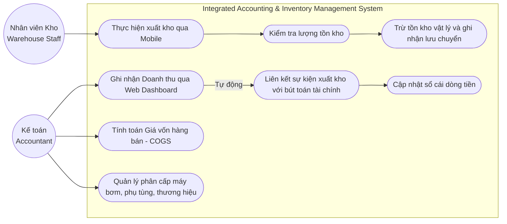
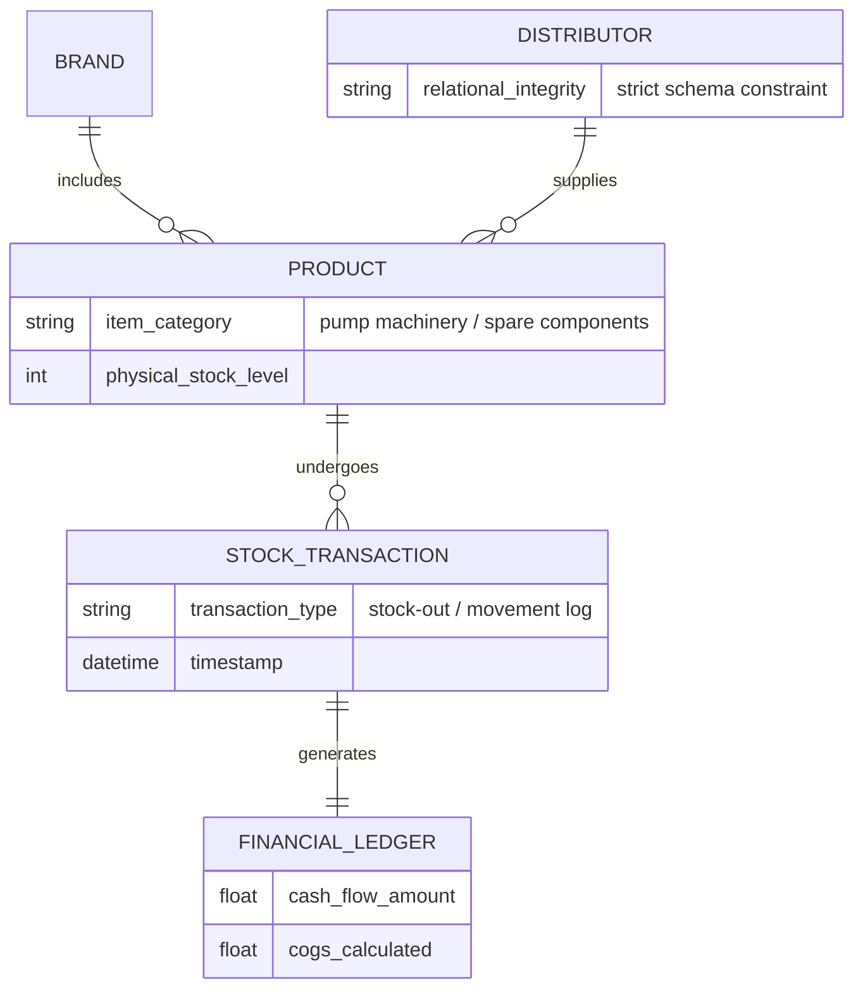
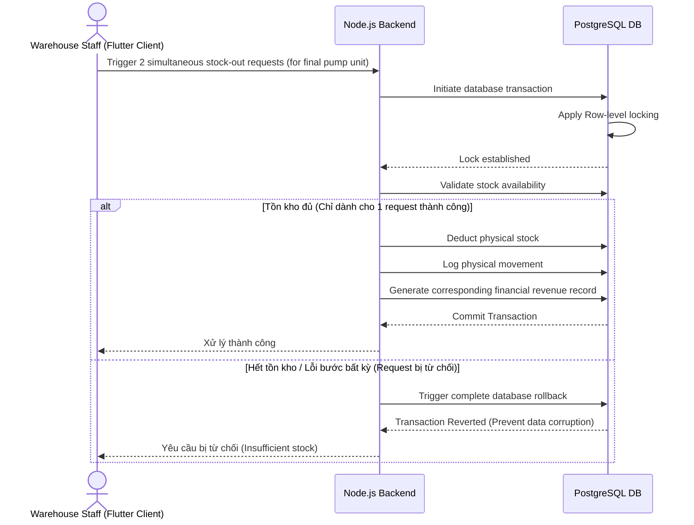

# Integrated-Accounting-Inventory-Management-System
## Sơ đồ Use Case (UCD)

```mermaid
graph LR
    WS((Nhân viên Kho<br>Warehouse Staff))
    ACC((Kế toán<br>Accountant))

    subgraph "Integrated Accounting & Inventory Management System"
        UC1([Quản lý phân cấp máy bơm, phụ tùng, thương hiệu])
        UC2([Thực hiện xuất kho qua Mobile])
        UC3([Kiểm tra lượng tồn kho])
        UC4([Trừ tồn kho vật lý và ghi nhận lưu chuyển])
        
        UC5([Ghi nhận Doanh thu qua Web Dashboard])
        UC6([Tính toán Giá vốn hàng bán - COGS])
        UC7([Cập nhật sổ cái dòng tiền])
        UC8([Liên kết sự kiện xuất kho với bút toán tài chính])
    end

    WS --> UC2
    UC2 --> UC3
    UC3 --> UC4
    
    ACC --> UC5
    UC5 -->|Tự động| UC8
    UC8 --> UC7
    ACC --> UC6
    ACC --> UC1
```
## Sơ đồ Thực thể - Liên kết (ERD)

```mermaid
erDiagram
    BRAND ||--o{ PRODUCT : "includes"
    DISTRIBUTOR ||--o{ PRODUCT : "supplies"
    PRODUCT ||--o{ STOCK_TRANSACTION : "undergoes"
    STOCK_TRANSACTION ||--|| FINANCIAL_LEDGER : "generates"

    PRODUCT {
        string item_category "pump machinery / spare components"
        int physical_stock_level
    }
    STOCK_TRANSACTION {
        string transaction_type "stock-out / movement log"
        datetime timestamp
    }
    FINANCIAL_LEDGER {
        float cash_flow_amount
        float cogs_calculated
    }
    DISTRIBUTOR {
        string relational_integrity "strict schema constraint"
    }
```
## Sơ đồ Trình tự (Sequence Diagram)

```mermaid
sequenceDiagram
    actor Staff as Warehouse Staff (Flutter Client)
    participant API as Node.js Backend
    participant DB as PostgreSQL DB

    Staff->>API: Trigger 2 simultaneous stock-out requests (for final pump unit)
    API->>DB: Initiate database transaction
    DB->>DB: Apply Row-level locking
    DB-->>API: Lock established
    
    API->>DB: Validate stock availability
    
    alt Tồn kho đủ (Chỉ dành cho 1 request thành công)
        API->>DB: Deduct physical stock
        API->>DB: Log physical movement
        API->>DB: Generate corresponding financial revenue record
        DB-->>API: Commit Transaction
        API-->>Staff: Xử lý thành công
    else Hết tồn kho / Lỗi bước bất kỳ (Request bị từ chối)
        API->>DB: Trigger complete database rollback
        DB-->>API: Transaction Reverted (Prevent data corruption)
        API-->>Staff: Yêu cầu bị từ chối (Insufficient stock)
    end
```
