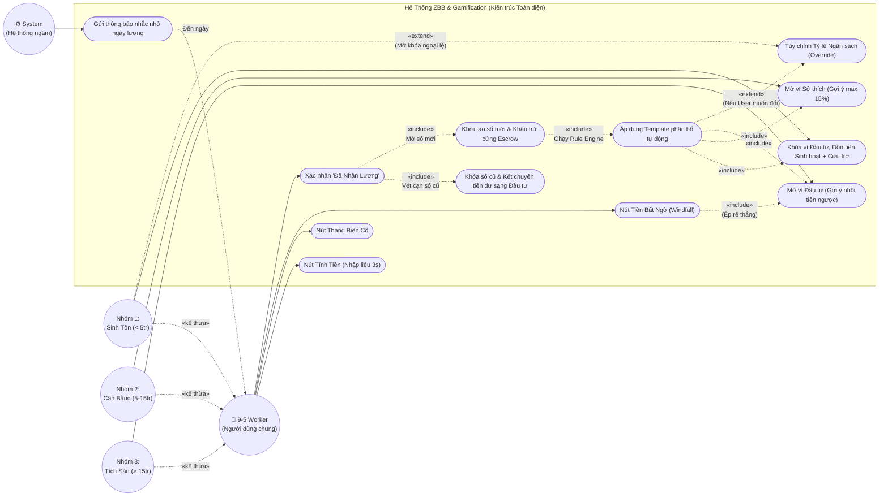
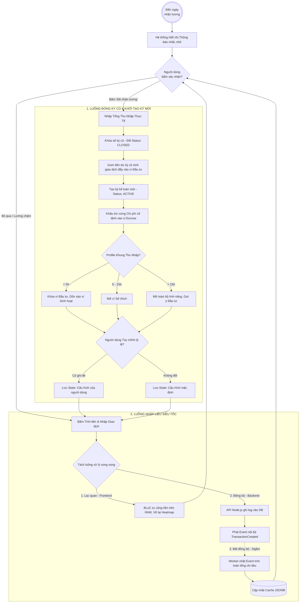
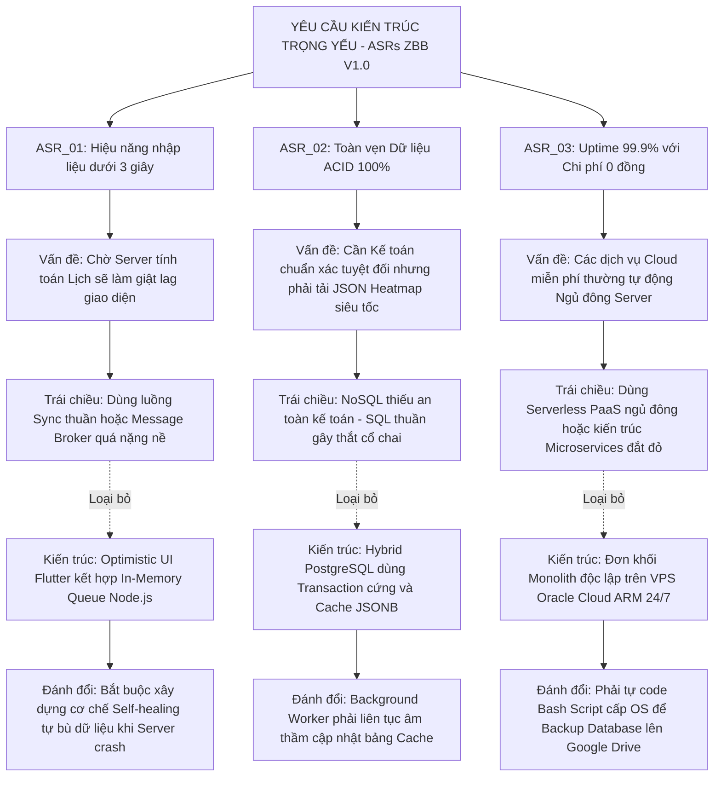

# Integrated-Accounting-Inventory-Management-System
## Sơ đồ Use Case (UCD)

```mermaid
flowchart LR
    %% ==========================================
    %% 1. ACTORS & KẾ THỪA (GENERALIZATION)
    %% ==========================================
    User(("👤 9-5 Worker\n(Người dùng chung)"))
    
    U_Tier1(("Nhóm 1:\nSinh Tồn (< 5tr)"))
    U_Tier2(("Nhóm 2:\nCân Bằng (5-15tr)"))
    U_Tier3(("Nhóm 3:\nTích Sản (> 15tr)"))
    
    System(("⚙️ System\n(Hệ thống ngầm)"))

    U_Tier1 -. "«kế thừa»" .-> User
    U_Tier2 -. "«kế thừa»" .-> User
    U_Tier3 -. "«kế thừa»" .-> User

    %% ==========================================
    %% 2. RANH GIỚI HỆ THỐNG
    %% ==========================================
    subgraph ZBB ["Hệ Thống ZBB & Gamification (Kiến trúc Toàn diện)"]
        direction TB
        
        %% Hệ thống tự động
        Sys_Notify(["Gửi thông báo nhắc nhở ngày lương"])
        
        %% Cụm Nút Tương Tác (Triggers)
        N1(["Nút Tính Tiền (Nhập liệu 3s)"])
        N2(["Nút Tháng Biến Cố"])
        N3(["Nút Tiền Bất Ngờ (Windfall)"])
        N4(["Xác nhận 'Đã Nhận Lương'"])
        
        %% Cụm Đóng Sổ & Khởi Tạo
        UC_Rollover(["Khóa sổ cũ & Kết chuyển tiền dư sang Đầu tư"])
        UC_Init(["Khởi tạo sổ mới & Khấu trừ cứng Escrow"])
        
        %% Cụm Template & Ghi đè
        T_Auto(["Áp dụng Template phân bổ tự động"])
        T_Custom(["Tùy chỉnh Tỷ lệ Ngân sách (Override)"])
        
        %% Cụm Chức năng Phân quyền theo Tier
        F_T1(["Khóa ví Đầu tư, Dồn tiền Sinh hoạt + Cứu trợ"])
        F_T2(["Mở ví Sở thích (Gợi ý max 15%)"])
        F_T3(["Mở ví Đầu tư (Gợi ý nhồi tiền ngược)"])
    end

    %% ==========================================
    %% 3. QUAN HỆ TƯƠNG TÁC
    %% ==========================================
    
    %% Tương tác từ Hệ thống
    System --> Sys_Notify
    Sys_Notify -.->|Đến ngày| User

    %% Tương tác cơ bản của User
    User --> N1
    User --> N2
    User --> N3
    User --> N4

    %% Logic Tiền Bất Ngờ (Trị bệnh Kế toán tâm lý)
    N3 -. "«include»\n(Ép rẽ thẳng)" .-> F_T3

    %% Logic Đóng/Mở sổ ngay khi bấm Xác nhận Lương
    N4 -. "«include»\nVét cạn sổ cũ" .-> UC_Rollover
    N4 -. "«include»\nMở sổ mới" .-> UC_Init
    UC_Init -. "«include»\nChạy Rule Engine" .-> T_Auto

    %% Định tuyến Template tự động
    T_Auto -. "«include»" .-> F_T1
    T_Auto -. "«include»" .-> F_T2
    T_Auto -. "«include»" .-> F_T3

    %% Quyền truy cập theo Tier
    U_Tier1 --> F_T1
    U_Tier2 --> F_T2
    U_Tier3 --> F_T3

    %% Logic Ghi đè (Tùy chỉnh linh hoạt)
    T_Auto -. "«extend»\n(Nếu User muốn đổi)" .-> T_Custom
    U_Tier1 -. "«extend»\n(Mở khóa ngoại lệ)" .-> T_Custom
```

## Sơ đồ Hoạt động (Activity Diagram)

```mermaid
flowchart TD
    %% ==========================================
    %% ĐIỂM KÍCH HOẠT (USER-TRIGGERED EVENT)
    %% ==========================================
    Start(((Đến ngày\nnhận lương))) --> SysNotify
    SysNotify[Hệ thống hiển thị Thông báo nhắc nhở] --> WaitUser

    WaitUser{Người dùng\nbấm xác nhận?}
    WaitUser -->|Bỏ qua / Lương chậm| POS_Trigger
    WaitUser -->|Bấm 'Đã nhận lương'| InputGross

    %% ==========================================
    %% 1. LUỒNG ĐÓNG SỔ & KHỞI TẠO (TRANSACTION LIỀN MẠCH)
    %% ==========================================
    subgraph P1 [1. LUỒNG ĐÓNG KỲ CŨ & KHỞI TẠO KỲ MỚI]
        direction TB
        InputGross[Nhập Tổng Thu Nhập Thực Tế] --> CloseOld
        
        %% Chốt sổ xảy ra ngay sau khi nhập lương
        CloseOld[Khóa sổ kỳ cũ - Đổi Status: CLOSED] --> MoveExcess
        MoveExcess[Gom tiền dư kỳ cũ sinh giao dịch đẩy vào ví Đầu tư] --> CreateNew
        
        %% Bắt đầu chia tiền
        CreateNew[Tạo kỳ kế toán mới - Status: ACTIVE] --> LockEscrow
        LockEscrow[Khấu trừ cứng Chi phí cố định vào ví Escrow] --> TierCheck

        TierCheck{Profile Khung Thu Nhập?}
        
        TierCheck -->|< 5tr| T1[Khóa ví Đầu tư, Dồn vào ví Sinh hoạt]
        TierCheck -->|5 - 15tr| T2[Mở ví Sở thích]
        TierCheck -->|> 15tr| T3[Mở toàn bộ tính năng, Gợi ý Đầu tư]
        
        T1 --> Override
        T2 --> Override
        T3 --> Override
        
        Override{Người dùng Tùy chỉnh tỷ lệ?}
        Override -->|Có ghi đè| CustomRatio[Lưu State: Cấu hình của người dùng]
        Override -->|Không đổi| ApplyBase[Lưu State: Cấu hình mặc định]
    end

    CustomRatio --> POS_Trigger
    ApplyBase --> POS_Trigger

    %% ==========================================
    %% 2. LUỒNG NHẬP LIỆU BẤT ĐỒNG BỘ
    %% ==========================================
    subgraph P2 [2. LUỒNG NHẬP LIỆU SIÊU TỐC]
        direction TB
        POS_Trigger[Bấm Tính tiền & Nhập Giao dịch] --> Split_Fork

        Split_Fork{Tách luồng xử lý song song}
        
        %% Nhánh Frontend
        Split_Fork -->|1. Lạc quan - Frontend| UI_Opt[BLoC tự cộng tiền trên RAM, Vẽ lại Heatmap]
        
        %% Nhánh Backend
        Split_Fork -->|2. Đồng bộ - Backend| API_Sync[API Node.js ghi log vào DB]
        
        API_Sync --> TriggerEvent[Phát Event nội bộ TransactionCreated]
        
        %% Nhánh Worker
        TriggerEvent -.->|3. Bất đồng bộ - Ngầm| Worker[Worker nhặt Event tính toán tổng chi tiêu]
        Worker --> UpdateDB[(Cập nhật Cache JSONB)]
    end

    %% Vòng lặp chờ đợi
    UI_Opt --> WaitUser
    UpdateDB --> WaitUser
```

## Sơ đồ ASRs

```mermaid
flowchart TD
    %% ==========================================
    %% GỐC KIẾN TRÚC
    %% ==========================================
    Root[YÊU CẦU KIẾN TRÚC TRỌNG YẾU - ASRs ZBB V1.0]

    %% ==========================================
    %% ASR 01: HIỆU NĂNG
    %% ==========================================
    Root --> ASR1[ASR_01: Hiệu năng nhập liệu dưới 3 giây]
    ASR1 --> Prob1[Vấn đề: Chờ Server tính toán Lịch sẽ làm giật lag giao diện]
    Prob1 --> Reject1[Trái chiều: Dùng luồng Sync thuần hoặc Message Broker quá nặng nề]
    Reject1 -. Loại bỏ .-> Dec1[Kiến trúc: Optimistic UI Flutter kết hợp In-Memory Queue Node.js]
    Dec1 --> Trade1[Đánh đổi: Bắt buộc xây dựng cơ chế Self-healing tự bù dữ liệu khi Server crash]

    %% ==========================================
    %% ASR 02: DỮ LIỆU
    %% ==========================================
    Root --> ASR2[ASR_02: Toàn vẹn Dữ liệu ACID 100%]
    ASR2 --> Prob2[Vấn đề: Cần Kế toán chuẩn xác tuyệt đối nhưng phải tải JSON Heatmap siêu tốc]
    Prob2 --> Reject2[Trái chiều: NoSQL thiếu an toàn kế toán - SQL thuần gây thắt cổ chai]
    Reject2 -. Loại bỏ .-> Dec2[Kiến trúc: Hybrid PostgreSQL dùng Transaction cứng và Cache JSONB]
    Dec2 --> Trade2[Đánh đổi: Background Worker phải liên tục âm thầm cập nhật bảng Cache]

    %% ==========================================
    %% ASR 03: HẠ TẦNG
    %% ==========================================
    Root --> ASR3[ASR_03: Uptime 99.9% với Chi phí 0 đồng]
    ASR3 --> Prob3[Vấn đề: Các dịch vụ Cloud miễn phí thường tự động Ngủ đông Server]
    Prob3 --> Reject3[Trái chiều: Dùng Serverless PaaS ngủ đông hoặc kiến trúc Microservices đắt đỏ]
    Reject3 -. Loại bỏ .-> Dec3[Kiến trúc: Đơn khối Monolith độc lập trên VPS Oracle Cloud ARM 24/7]
    Dec3 --> Trade3[Đánh đổi: Phải tự code Bash Script cấp OS để Backup Database lên Google Drive]
```
